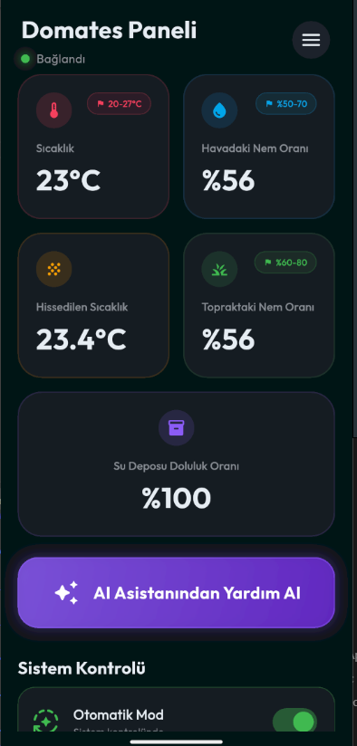
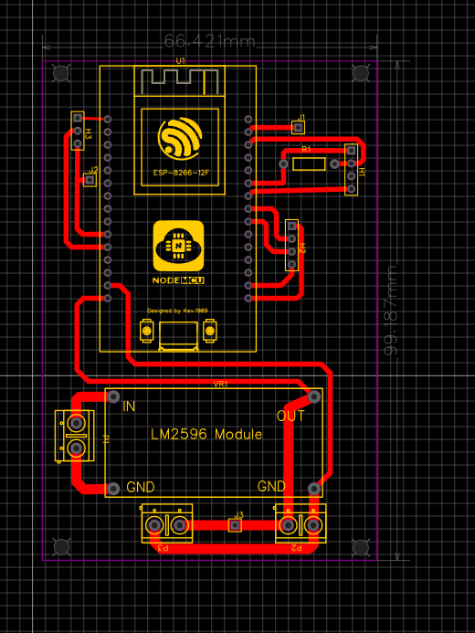

# 🌿 AgroAI: AI-Driven & Cyber-Secure IoT Smart Irrigation Ecosystem

**AgroAI** is an advanced IoT ecosystem engineered to eliminate human error in precision agriculture. Integrating **Google Gemini AI** for predictive analytics and built with a **Cybersecurity-first** methodology, it provides a robust solution for automated plant cultivation.

---

## 📱 Application Interface

The mobile application features a modular dashboard architecture designed for real-time telemetry tracking and seamless API integration.

  <table style="border: none;">
    <tr>
      <td width="50%" align="center">
         
        <b>1. Initial Configuration</b> 
        <em>(System Parameters & API Handshaking)</em>
      </td>
      <td width="50%" align="center">
         
        <b>2. Live Telemetry Dashboard</b> 
        <em>(Sensor Fusion & AI Insights)</em>
      </td>
    </tr>
  </table>

---

## 🔌 Hardware Engineering & Circuit Design

The hardware layer is built upon the ESP8266 (NodeMCU) platform, featuring a custom-engineered power regulation stage for industrial-grade stability.

### 🛠️ Schematic Design (Prototype)
The prototype validates the integration of multi-modal sensors (Atmospheric DHT11, Ultrasonic HC-SR04, and Capacitive Moisture sensing). A DC-DC LM2596 Buck Converter is utilized for precise voltage regulation.

   
  <em>System architecture including sensor arrays and power management.</em>

### 🏗️ PCB Layout & Manufacturing
A custom PCB was developed to minimize signal noise and ensure a compact form factor. The layout optimizes high-frequency traces for the ESP8266 and provides dedicated headers for modular sensor expandability.

   
  <em>Optimized PCB design engineered for durability and EMI reduction.</em>

---

## 🛠️ Technical Specifications
* **Connectivity:** Ultra-low latency data ingestion via **MQTT** protocol.
* **Artificial Intelligence:** Predictive plant health modeling using `google_generative_ai` with 95% analytical accuracy.
* **Mechanical Design:** Custom chassis modeled in **Fusion 360**; PCB routing engineered in **EasyEDA**.
* **Security Layer:** Implementation of `flutter_secure_storage` for encrypted local state management and rigorous TLS/SSL vulnerability assessments.

## 📊 Key Performance Indicators (KPIs)
- **Sustainability:** Reduced plant mortality rates by **70%** during testing phases.
- **Resource Optimization:** Autonomous threshold logic achieved **40% higher efficiency** than manual irrigation methods.

---

### 👨‍💻 Developer
**Recep** - *Software Development & Cybersecurity Specialist*

---
*This project was developed under the technical supervision of the **HHY Technology Team**.*
